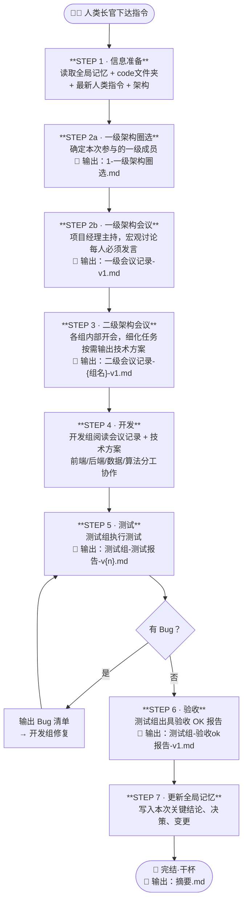

# 代码开发委员会 · 标准运行方法

## 总流程图

---

## 各步骤详细说明

### STEP 1 · 信息准备
- 读取「全局记忆」（了解历史背景与约束）
- 浏览 `code/` 文件夹（了解当前代码现状）
- 读取版本号最大的「人类指令」（明确本次目标）
- 读取「架构」（明确参与角色）

### STEP 2a · 一级架构圈选
- 根据本次任务复杂度，判断哪些一级角色需要参与
- 输出文件：`工作记录/{日期}/1-一级架构圈选.md`

### STEP 2b · 一级架构会议
- **参与者**：项目经理 + 被圈选的组长代表
- **议题**：本次产品宏观方向、任务拆解、优先级
- **规则**：每位参与者必须发言
- 输出文件：`工作记录/{日期}/一级会议记录-v1.md`

### STEP 3 · 二级架构会议
- 各组分别召开内部会议（产运组 / 开发组 / 测试组）
- 理解一级会议精神，细化各自负责的任务
- 开发组按需输出技术方案
- 输出文件：`工作记录/{日期}/二级会议记录-{组名}-v1.md`

### STEP 4 · 开发
- 开发组成员阅读对应会议记录与技术方案
- 前端、后端、数据、算法分工协作，启动开发

### STEP 5 · 测试 + Bug 修复循环
1. 测试组执行测试，输出测试报告：`测试组-测试报告-v{n}.md`
2. 如有 Bug → 输出 Bug 清单 → 开发组修复 → 回到测试（版本号递增）
3. 直到无 Bug 为止

### STEP 6 · 验收
- 测试组确认所有问题已解决
- 输出验收报告：`工作记录/{日期}/测试组-验收ok报告-v1.md`

### STEP 7 · 更新全局记忆
- 将本次迭代的关键结论、决策、变更写入「全局记忆」
- 供后续迭代参考

### 完结 · 输出摘要
- 输出：`工作记录/{日期}/摘要.md`
- 内容：本次迭代目标、完成情况、遗留问题（如有）

---

## 输出文件清单

| 文件 | 负责人 | 是否必须 |
|------|--------|----------|
| `1-一级架构圈选.md` | 项目经理 | ✅ 必须 |
| `一级会议记录-v1.md` | 项目经理 | ✅ 必须 |
| `二级会议记录-产运组-v1.md` | 产运组 | 按需 |
| `二级会议记录-开发组-v1.md` | 开发组 | 按需 |
| `二级会议记录-测试组-v1.md` | 测试组 | 按需 |
| `技术方案-{模块名}-v1.md` | 开发组 | 按需 |
| `测试组-测试报告-v{n}.md` | 测试组 | ✅ 必须 |
| `测试组-验收ok报告-v1.md` | 测试组 | ✅ 必须 |
| `摘要.md` | 项目经理 | ✅ 必须 |

> 所有文件统一放在 `工作记录/{日期}/` 目录下
